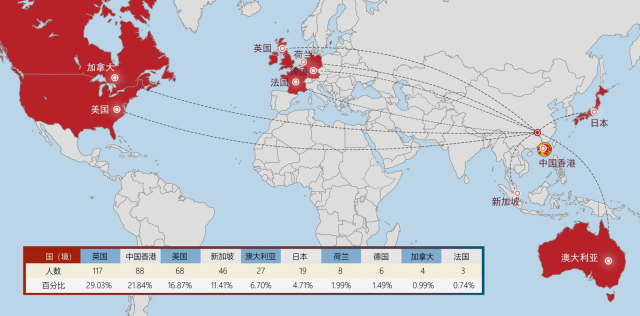

# 🌍 湖大毕业生去向

&#x20;   2021届本科毕业生出国（境）深造 403 人，占本科毕业生总人数的 8.51%。 目的地首选英国（29.03%），其次是中国香港（21.84%），美国（16.87%）。

其中205人（占出国人数50.87%）是世界排名前50（QS排名）的高校，

321人（占出国人数79.65%）是世界排名前100（QS排名）的高校

.png>)

近几年国内清北和各985高校留学比例一年比一年低，疫情是其中很重要一个原因。

再加之现在就业形势严峻，所以更多的人会去卷保研、考研。考研人数每年都在以可怕的速度增长，今年预计会达到500万。

在这样的形势下，出国留学不失为一种“另辟蹊径”的手段，让你的未来多一种可能。
