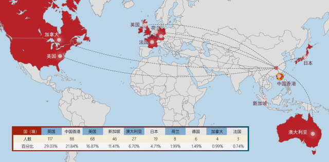

# 🌍 留学概况

## 湖大2021年留学官方数据

2021届本科毕业生出国（境）深造 403 人，占本科毕业生总人数的 8.51%。

目的地首选英国（29.03%），其次是中国香港（21.84%），美国（16.87%）。

其中205人（占出国人数50.87%）是世界排名前50（QS排名）的高校，

321人（占出国人数79.65%）是世界排名前100（QS排名）的高校

.png>)
