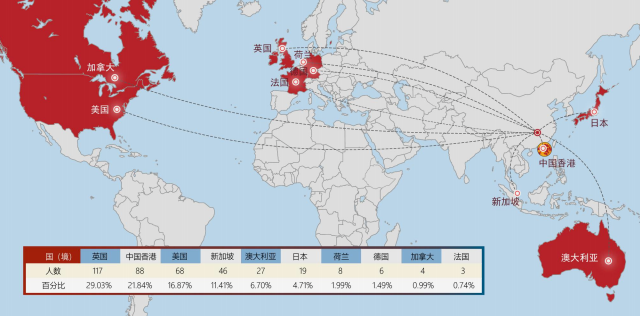

# 🌍 湖大21届毕业生去向

&#x20;   2021届本科毕业生出国（境）深造 403 人，占本科毕业生总人数的 8.51%。 目的地首选英国（29.03%），其次是中国香港（21.84%），美国（16.87%）。

其中205人（占出国人数50.87%）是世界排名前50（QS排名）的高校，

&#x20;      321人（占出国人数79.65%）是世界排名前100（QS排名）的高校

.png>)

&#x20;   近几年国内清北和各985高校留学比例一年比一年低，疫情是其中很重要一个原因。当今中国的飞速发展大家也有目共睹，不一定只有出国一条路，现在大家都在卷保研、考研也不是没有原因的。
