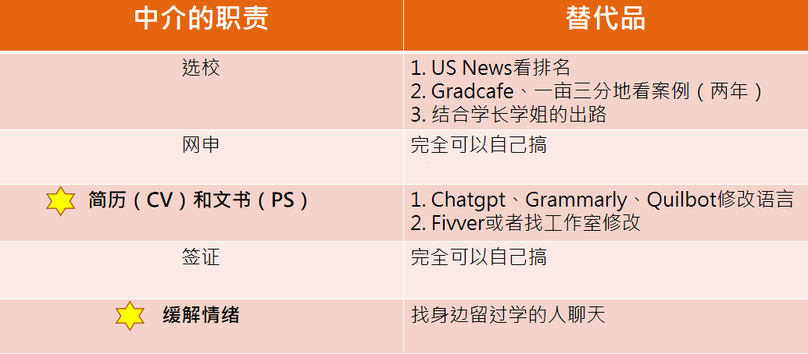

# 🤎 邵同学-2023界数学院-芝加哥大学

## 收到的offer（都是硕士）：芝大应数、布朗DECES、JHU应数、巴黎理工M1应数、华盛顿大学应数

GPA 3.55（6/48）

托福111（听、读30，写28，说23）

GRE 323（153+170+3.5）

讨论班+中科院科创计划+Mitacs暑研

一实习

#### 录取指标粗略排序

博士、学硕：推荐信 = 文章 > GPA > 科研、实习经历 >托福、GRE

就业硕士：GPA > 实习 > 研究经历 > 托福、GRE > 推荐信

GPA：可量化。最少要达到3.5，最好在3.7以上

英语：托福100（听力22），Gre（320+3.5）

研究、实习：利用好互联网和湖大资源，抓住机会

论文：申博尽量争取，学硕不强求

## 英语准备

大二下第一次考托福，总分100（读30，听26，写22，说22）

大三暑假GRE，323（V153，Q170，W3.5）

大四上二刷托福，总分111（读30，听30，写28，说23）

准备时间都在一周到两周——>功夫在平时

#### 英语积累

公众号：精彩英语演讲、精彩英文演讲、米国脱口秀

B站：TED演讲、任何感兴趣的英文up主

英语书籍：经济学人、时代杂志；小王子、了不起的盖茨比

其他：Youtube

#### 学习资源

真题网站：新东方、考满分、雷哥…

写作修改：微软爱写作、Chatgpt、Grammarly、Quilbot

最好的课程：BestMyTest（油管）。陈琦的公开课也可以

#### 练习方法

#### 阅读：

找信息的意识：

1. 首先，粗略读第一段、中间段第一句和最后一句话、最后一段
2. 然后，结合题目锁定具体位置。
3. 改错时一定要重读文章， 找到错、慢的原因是在哪里

#### 听力：

不记笔记专心听，分层。

#### 写作：

多写并修改。背好的模板，积累素材

#### 口语：

口音无所谓，模板+内容+连贯。最好能找一个语言环境

## 研究机会

### 湖大：

讨论班，孕穗计划（这两个是数院特色），Mitacs暑研，学期交流项目

### 校外：&#x20;

#### 国内：

中科院科创计划、港科大暑研、港理工暑研

#### 国外：

亚洲：KAUST(土豪学校），KAIST、首尔大学

美国：UCLA(CSST)、UC Irvine（有官方途径），多数需要自己套

欧洲：EPFL、马普所等

#### 我的Mitacs暑研经历

&#x20;大三上（10月）：组织报名，准备材料(托福、简历）

12月：导师和同学在平台双向选择，出结果。

隔年1-5月：准备办签证

六月至九月：前往加拿大开展研究

## 是否选择中介

<figure><figcaption></figcaption></figure>

## 时间线

大二下：提升绩点，多涉猎数学

大二暑假：托福，学硕陶瓷研究机会，专硕找实习

大三上：保绩点，争取暑研机会，GRE

大三下：学期交流，英语二刷，科研或实习

大三暑假至大四上：写文书，继续完善背景
